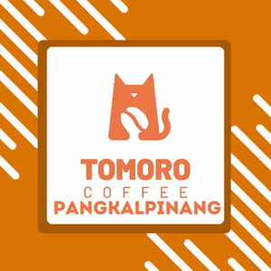

<div align="center">

# ☕ TOMORO COFFEE BANGKA

### Premium Coffee Experience Website



[](https://developer.mozilla.org/en-US/docs/Web/HTML)
[](https://developer.mozilla.org/en-US/docs/Web/CSS)
[](https://developer.mozilla.org/en-US/docs/Web/JavaScript)
[](#)
[](LICENSE)

**A modern, professional, and fully responsive coffee shop website built with pure HTML, CSS, and JavaScript.**  
Dirancang khusus untuk menghadirkan pengalaman digital eksklusif bagi penikmat kopi di Bangka Belitung.

[🌐 Live Demo](#) • [📖 Documentation](#documentation) • [🐛 Report Bug](#support) • [✨ Request Feature](#support)

---

### ⭐ Key Features

🎨 **Modern UI/UX** • 🌙 **Dark Mode (New!)** • 📱 **Fully Responsive** • 📸 **Instagram Feed (New!)**  
🛒 **WhatsApp Reservation** • 🌟 **Testimonial Carousel (New!)** • 📍 **Multi-Branch Support** • ⚡ **Performance Optimized**

---

</div>

## 📋 Table of Contents

- [About The Brand](#-about-the-brand)
- [Project Overview](#-project-overview)
- [New Features Spotlight](#-new-features-spotlight)
- [Technical Features](#-technical-features)
- [Pages & Sections](#-pages--sections)
- [Getting Started](#-getting-started)
- [Project Structure](#-project-structure)
- [Performance](#-performance)
- [License](#-license)
- [Contact](#-contact)

---

## 🎯 About The Brand

**TOMORO COFFEE** hadir di Pulau Bangka untuk membawa revolusi dalam menikmati kopi premium. Kami menyajikan kopi berkualitas internasional dengan harga yang terjangkau. Melalui website ini, kami ingin memastikan bahwa pengalaman premium (*Premium Experience*) pelanggan tidak hanya terasa saat mereka meneguk kopi kami di kedai, melainkan juga sejak pandangan pertama di dunia maya.

---

## 🚀 Project Overview

Proyek ini adalah representasi digital dari Tomoro Coffee Bangka. Dibangun tanpa mengandalkan *framework* berat (Vanilla HTML/CSS/JS), website ini menawarkan kecepatan memuat (*loading speed*) yang super cepat dipadukan dengan ratusan efek animasi yang memanjakan mata pengunjung.

### Why This Architecture?

- ✅ **No Framework Dependencies** - Memanfaatkan kekuatan murni dari HTML, CSS, dan JavaScript modern.
- ✅ **Performance Optimized** - *Loading* super cepat untuk menekan angka *bounce rate*.
- ✅ **SEO Friendly** - Penulisan HTML semantik agar mudah ditemukan di Google.
- ✅ **Mobile First** - Antarmuka yang sempurna di semua ukuran layar (dari layar HP kecil hingga monitor 4K).
- ✅ **WhatsApp Integration** - Konversi pemesanan langsung masuk ke WhatsApp kasir.

---

## ✨ New Features Spotlight (Terbaru!)

Untuk memaksimalkan pengalaman pengguna (*User Experience*) dan nilai jual, kami baru saja menambahkan fitur-fitur berkelas:

1. 🌙 **Dark Mode (Mode Gelap)**
   Pengunjung dapat mengubah tampilan seluruh website menjadi mode gelap dengan sekali klik. Sistem akan mengingat pilihan (*local storage*) pengunjung. Desain mode gelap memadukan warna hitam elegan dengan sorotan (*highlight*) *Tomoro Orange* yang sangat premium.

2. 🌟 **Customer Testimonial Carousel**
   Bagian *Social Proof* yang menampilkan ulasan positif pelanggan bergaya Google Review (5 Bintang Emas). Dirancang menggunakan teknologi *CSS Scroll Snapping*, pengguna HP dapat menggeser (*swipe*) kartu ulasan layaknya aplikasi asli yang mulus.

3. 📸 **Live Instagram Feed**
   Menampilkan galeri estetik dari unggahan Instagram Tomoro Coffee Bangka. Memberikan kesan *brand* yang aktif, dinamis, dan terus berinteraksi dengan komunitasnya.

---

## ⚙️ Technical Features

| Feature | Description |
|---------|-------------|
| **Dark Theme Auto-Save** | Menyimpan pilihan mode (terang/gelap) di memori browser |
| **CSS Scroll Snapping** | Navigasi sentuh halus (*swipe-to-scroll*) untuk elemen *Carousel* |
| **Sticky Navigation** | Menu transparan yang berubah warna saat di-*scroll* |
| **Parallax Scrolling** | Latar belakang bergerak untuk efek kedalaman (3D) |
| **Scroll Enhancements** | *Reading progress bar* & indikator letak halaman |
| **Form Validation** | Validasi pemesanan secara *real-time* dengan notifikasi (*toast*) |

---

## 📱 Pages & Sections

| Page/Section | Description |
|--------------|-------------|
| **🏠 Hero Section** | Layar pembuka yang dramatis dengan tombol aksi utama |
| **⭐ Features** | Keunggulan biji kopi, barista, dan lokasi |
| **📖 About Us** | Cerita perjalanan Tomoro Coffee |
| **🍽️ Menu** | Daftar menu minuman & makanan interaktif |
| **📸 Gallery** | Kumpulan foto produk berkualitas tinggi |
| **📲 App Download** | Promosi aplikasi loyalitas pelanggan (Tomoro Club) |
| **🌟 Testimonials** | Bukti sosial (*social proof*) dari pelanggan setia |
| **📍 Location** | Multi-Tab untuk melihat alamat dan peta cabang |
| **📸 Instagram** | *Grid* galeri estetik untuk menarik *followers* baru |

---

## 🚀 Getting Started

Untuk menjalankan *source code* website ini di perangkat lokal Anda:

### Prerequisites
- Web Browser modern (Chrome, Firefox, Safari, Edge)
- VS Code (disarankan menggunakan ekstensi **Live Server**)

### Installation
1. Clone repositori ini:
   ```bash
   git clone https://github.com/HansZknight/TOMORO-COFFEE-BANGKA-Web.git
   ```
2. Buka folder proyek di teks editor favorit Anda (VS Code).
3. Buka file `index.html`.
4. Jika menggunakan VS Code, klik kanan pada `index.html` dan pilih **"Open with Live Server"**.

---

## 📁 Project Structure

```text
tomoro-coffee-bangka/
├── index.html           # Main Landing Page
├── reservation.html     # Dedicated Reservation Page
├── css/
│   ├── main.css         # Core Styles, Variables, Dark Mode
│   └── responsive.css   # Media Queries for Mobile/Tablet
├── js/
│   ├── main.js          # Main Logic (Theme, Scroll, Forms)
│   └── animations.js    # Intersection Observers & Effects
└── assets/
    ├── icons/           # SVGs and Icons
    └── images/          # High-Quality Premium Assets
```

---

## ⚡ Performance

Website ini dioptimalkan untuk mencapai skor tinggi pada **Lighthouse / Web Vitals**:
- **Images**: Penggunaan kompresi (WebP).
- **CSS/JS**: Logika yang efisien, tanpa *blocking rendering* yang berlebihan.
- **Lazy Loading**: Gambar hanya dimuat saat di-*scroll* ke area layar pengguna.

---

## 📄 License

Distributed under the MIT License. See `LICENSE` for more information.

---

## 📞 Contact

**Tomoro Coffee Bangka Belitung**  
Email: [Perkasabisnisindonesia@gmail.com](mailto:Perkasabisnisindonesia@gmail.com)  
WhatsApp: [+62 821-8152-1691](https://wa.me/6282181521691)  

<div align="center">
  <br>
  <b>Crafted with ❤️ for Coffee Lovers</b>
</div>